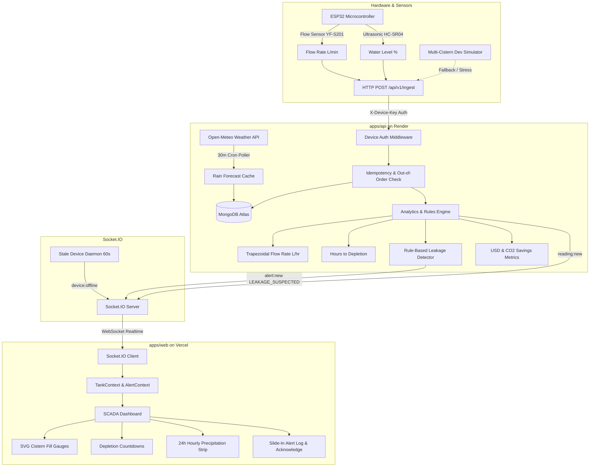

# AquaSave: Smart Rainwater Harvesting Management System

> Real-time SCADA telemetry, predictive depletion intelligence, rule-based leak detection, and weather-aware rainwater harvesting analytics for commercial and institutional facilities.

[](https://github.com/rakshittrivedi/AquaSave-Codefiesta/actions/workflows/ci.yml)
[](LICENSE)
[](<>)

---

## 🌐 Live Deployments

- **Frontend Dashboard (Vercel)**: [https://aquasave.vercel.app](https://aquasave.vercel.app)
- **Backend Telemetry API (Render)**: [https://aquasave-api.onrender.com](https://aquasave-api.onrender.com/api/v1/health)
- **API Health Endpoint**: `GET https://aquasave-api.onrender.com/api/v1/health`

---

## 🏗️ System Architecture

AquaSave integrates physical Internet-of-Things (IoT) edge sensors with a high-throughput Node.js telemetry pipeline and an industrial SCADA React interface.



---

## 🚀 Key Features

### P0 Core SCADA Capabilities

- **Industrial SCADA Design**: Dark-mode telemetry dashboard (`#0D1117` palette) designed for rapid operator comprehension with zero layout shifts.
- **Dynamic Water Level Visualizations**: SVG cistern cross-sections with reactive fluid levels, color-coded status pills (`Normal`, `Low Level`, `Critical`, `Offline`), and accessible screen-reader indicators.
- **Realtime Telemetry Streaming**: Sub-second telemetry propagation via Socket.IO room subscriptions (`tank:all` and `tank:{id}`).
- **Device Stale Detection**: Background daemon monitors heartbeat timeouts (5 min) and broadcasts immediate offline notifications.
- **Comprehensive Cistern Detail View**: Historical Recharts telemetry plots (water level % and flow rate L/min), daily consumption aggregations, and specifications.

### P1 Competitive Intelligence

- **Predictive Depletion Intelligence**: Numerical trapezoidal integration over historical readings calculates rolling consumption ($L/hr$) and precise hours to empty ($t_{\text{deplete}}$).
- **Rule-Based Leak Detection**:
  - _Rule 1_: Sustained discharge flow while reservoir level remains static.
  - _Rule 2_: Uninterrupted flow without standard idle resting intervals.
  - Auto-emits real-time `LEAKAGE_SUSPECTED` alarms.
- **Environmental & Financial Metrics**: Real-time cumulative calculation of water harvested ($L$), municipal cost saved ($\$0.003/L$), and carbon offset ($0.000298\text{ kg } CO_2/L$).
- **Open-Meteo Rain Forecasting**: 24-hour predictive precipitation strip with automatic alert banners advising operators before rainfall events ($>5\text{mm}$).
- **Interactive Alerts Management**: Accessible slide-in drawer displaying recent anomalies with persistent acknowledgement workflow.

---

## 🛠️ Tech Stack

| Layer           | Technologies                                                                              |
| --------------- | ----------------------------------------------------------------------------------------- |
| **Frontend**    | React 18, TypeScript, Vite, Tailwind CSS, Recharts, Lucide Icons, Vitest, Testing Library |
| **Backend**     | Node.js, Express, TypeScript, Zod, Mongoose, Socket.IO, Pino Logger, Vitest               |
| **Database**    | MongoDB Atlas (Multi-collection telemetry and daily rollups)                              |
| **IoT / Edge**  | ESP32 DevKit v1, C++ / Arduino, HC-SR04 Ultrasonic, YF-S201 Flow Sensor                   |
| **DevOps & CI** | GitHub Actions (Lint, Test, Build), Render, Vercel, Husky, Lint-Staged                    |

---

## ⚡ Quickstart Guide

### Prerequisites

- Node.js 20+
- npm 10+
- MongoDB instance (local or Atlas)

### 1. Clone & Install

```bash
git clone https://github.com/rakshittrivedi/AquaSave-Codefiesta.git
cd AquaSave-Codefiesta
npm install
```

### 2. Environment Configuration

Create `.env` in `apps/api`:

```env
PORT=3001
NODE_ENV=development
MONGODB_URI=mongodb://localhost:27017/aquasave
CORS_ORIGIN=http://localhost:5173
LOG_LEVEL=info
```

Create `.env` in `apps/web`:

```env
VITE_API_URL=http://localhost:3001
VITE_SOCKET_URL=http://localhost:3001
```

### 3. Seed Database & Start Development

In three terminal tabs:

```bash
# Terminal 1: Start Backend API
npm run dev:api

# Terminal 2: Start Frontend Web Dashboard
npm run dev:web

# Terminal 3: Start Multi-Cistern IoT Simulator
npm run dev:simulator
```

Visit [http://localhost:5173](http://localhost:5173) to view the live dashboard.

---

## 🧪 Testing & Verification

Run the full automated test suite (34 unit and end-to-end integration tests):

```bash
# Run tests across all workspaces
npm test

# Run linter
npm run lint

# Check formatting
npm run format:check

# Run production build
npm run build
```

---

## 🔌 Hardware Integration

For complete pinouts, resistor divider schematics, sensor calibration formulas, and ESP32 C++ firmware code, refer to the [Hardware Integration Guide](file:///c:/Rainwater/docs/hardware-integration.md).

Firmware source file: [`tools/simulator/firmware/esp32_aquasave.ino`](file:///c:/Rainwater/tools/simulator/firmware/esp32_aquasave.ino).

---

## 👥 Team & Credits

Developed for the 24-hour **Codefiesta Hackathon**:

- **Rakshit Trivedi** & Team — System Architecture, Full-Stack SCADA Implementation, and Hardware Firmware Integration.
