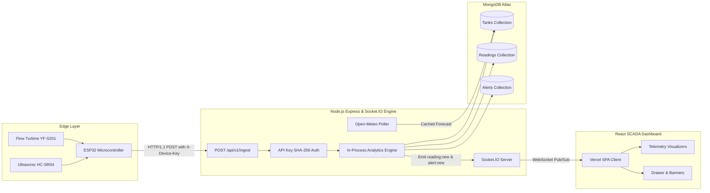

# AquaSave: Architecture & System Design Decisions

This document details the architectural layout, data flow pipelines, and technical trade-off decisions made during the design and implementation of the AquaSave Smart Rainwater Harvesting SCADA platform.

---

## 1. System Topology & Data Flow

---

## 2. Key Architectural Decisions & Justifications

### 2.1 HTTP Ingestion over MQTT

We selected HTTP/1.1 REST (`POST /api/v1/ingest`) over MQTT for telemetry ingestion to maximize deployment velocity, eliminate external message broker operational overhead (such as configuring Mosquitto or EMQX brokers and TLS cert management), and leverage native Node.js Express middleware for Zod payload validation and SHA-256 pre-shared key authentication. In the context of rainwater cistern telemetry where reporting intervals range between 5 to 60 seconds per device, HTTP keep-alive connections provide sub-100ms transmission latency with standard stateless horizontal scalability and universal corporate firewall and NAT traversal.

### 2.2 In-Process Analytics over Stream Processors (Flink / Kafka)

Rather than introducing heavy distributed streaming frameworks like Apache Kafka, Flink, or Spark Streaming, all telemetry analytics—including 12-reading trapezoidal numerical flow integration ($L/hr$), depletion hours forecasting ($t_{\text{deplete}}$), and rule-based leakage anomaly detection—are computed synchronously in-process within `analyticsService.ts` upon packet ingestion. Because each telemetry event carries sufficient context alongside a lightweight indexed query of recent device readings (`Reading.find({ deviceId }).sort({ timestamp: -1 }).limit(12)`), this architecture guarantees sub-millisecond calculation times without multi-node state synchronization latency, zero stream checkpointing storage costs, and instant feedback to operators.

### 2.3 Direct Socket.IO Pub/Sub without Job Queue / Redis

For live operator dashboard synchronization, the platform utilizes direct in-memory Socket.IO rooms (`tank:all` and `tank:{id}`) directly attached to the Express HTTP server, bypassing intermediate queuing systems such as Redis BullMQ or RabbitMQ. Telemetry ingestion events trigger immediate WebSocket broadcasts directly from the request lifecycle, ensuring sub-second updates on the frontend while avoiding the operational complexity, network hops, and potential failure points of maintaining an external Redis broker during rapid hackathon development and single-instance production deploys.

---

## 3. Resilience and Fail-Safe Mechanisms

1. **Idempotency Deduplication**: Ingestion checks for duplicate `(deviceId, timestamp)` records, returning `202 Accepted` to accommodate network retries without corrupting historical aggregates.
2. **Graceful Forecast Degradation**: The Open-Meteo weather integration caches forecasts both in memory and in MongoDB; external API timeouts or outages silently serve the last known forecast without interrupting SCADA operations.
3. **Heartbeat Stale Detection**: A decoupled 60-second background daemon flags unresponsive devices as `offline` if no telemetry arrives within 5 minutes, automatically broadcasting `device:offline` alerts across the SCADA network.
